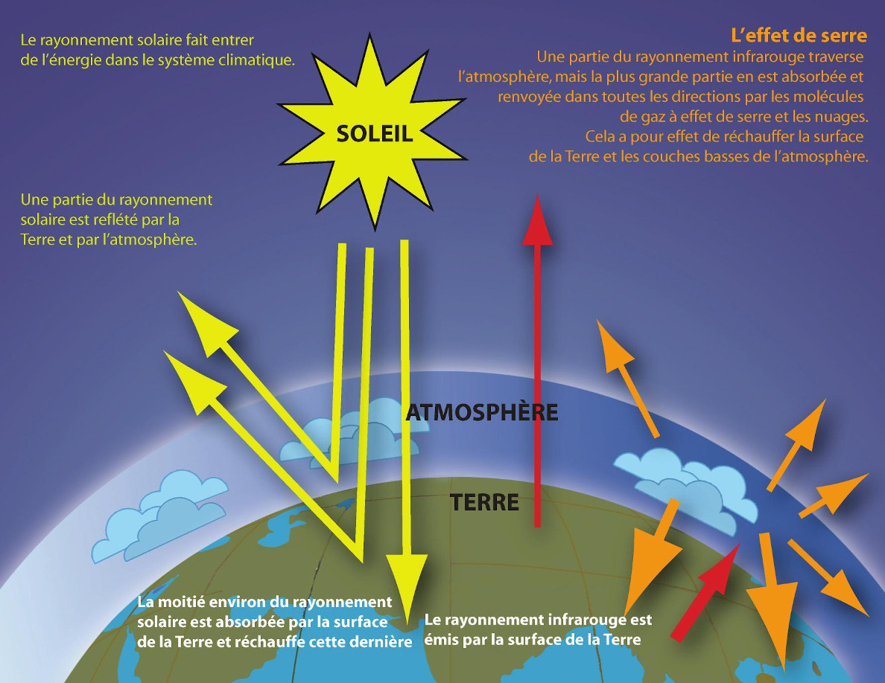

# Calcul Numérique TD1: Simulation d'un modèle climatique simple

## Partie A: Preuve de la convergence de la méthode d'Euler explicite

Soit le problème de Cauchy suivant:

$$
        \left\{
        \begin{array}{l}
            y' = f(t,y(t))          \\
            y(t_0) = y_0, t_0 \in I \\
        \end{array}
        \right.
$$

avec $f$ définie sur $\mathbb{R} \times \mathbb{R} \rightarrow \mathbb{R}$.

La fonction $f(t, y(t))$ est continue et Lipschitzienne en $y$, c'est à dire

$$ 
\forall t,y_1,y_2, \exists k > 0, \qquad |f(t,y_1) - f(t,y_2)| \leq k|y_1-y_2| 
$$

Soit $h > 0$ le pas d'intégration, la méthode d'Euler explicite s'exprime récursivement:

$$ 
\widetilde{y}_{n+1} = \widetilde{y}_n + hf(t_n, \widetilde{y}_n) \qquad t_n = nh
$$ 

On s'intéresse à l'erreur locale à l'étape $n+1$, 

$$
|e_{n+1}| = |y(t_{n+1}) - \widetilde{y}_{n+1}|
$$

1. Montrer que $|e_{n+1}| \le (1+kh)|e_n| + mh^2$ où $k > 0$ et $m \in \mathbb{R}$ sont deux constantes.

   _Conseils:_
   - Utiliser un développement de Taylor à l'ordre 2 de $y$.   
   - Utiliser le fait que $f$ est $k$-Lipschitzienne sur la deuxième variable. 

2. Montrer que $|e_n| \le (1+kh)^n(|e_0| + \frac{m}{k}h)$

   _Conseils:_
   - Sommer télescopiquement $|e_{n+1}| - |e_{n}|$
   - Utiliser la majoration montrée dans la question A.1

3. Montrer que $|e_n| \le e^{khn}(|e_0|+\frac{m}{k}h)$

   _Conseils:_
   - Montrer que $(1+kh) \le e^{kh}$ 

4. Montrez que $\forall n,\;\lim_{h \rightarrow 0} |e_n| = 0$ lorsque $\widetilde{y}_0 = y(t_0)$. Que pouvez vous dire sur la vitesse de convergence ?

## Partie B: Un modèle climatique simple

Dans cette partie nous souhaitons simuler le réchauffement climatique par un modèle simple de l'effet de serre.

Le modèle utilisé est une simplification du modèle utilisé dans les logiciel [SimClimat](https://www.lmd.jussieu.fr/~crlmd/simclimat/) développé par Camille Risi et [py-simclimat](https://gitlab.in2p3.fr/alexis.tantet/py-simclimat) développé par Alexis Tantet. 

### Description du modèle

La figure ci-dessous, extraite du rapport du [GIEC](https://www.ipcc.ch/languages-2/francais/) 2007, schématise l'effet de serre naturel.

Pour modéliser l'effet de serre, nous allons utiliser un modèle radiatif global.

- Radiatif: car nous allons faire le bilan énergétique des rayonnements entrants et sortants.
- Global: car nous considérons la terre comme un seul point et ne modélisons pas des phénomènes localisés.

#### Puissance entrante

La puissance entrante est due au rayonnement solaire. Elle correspond à $S_0/4$ où la constante solaire $S_0=1370W.m^{-2}$. Le facteur $\frac{1}{4}$ est nécessaire car seulement un quart du globle est éclairé par le soleil à chaque instant. 

Néanmoins une partie de ce rayonnement est reflété par la terre et l'atmosphère. L'albedo planétaire, $\alpha$, est la fraction du rayonnement reflété.

Ainsi, la puissance entrante est 

$$P_{in} = (1-\alpha)\frac{S_0}{4}$$

#### Puissance sortante

La puissance sortante est émise sous forme d'infrarouges par la surface de la terre. En considérant que la terre est un corps noir, elle peut-être calculée avec la formule $\sigma.T^4$ où $\sigma$ est la constante de Stefan-Boltzmann et $T$ est la température. 

À nouveau, une partie du rayonnment infrarouge est absorbé et rediffusé par l'atmosphère dans toutes les directions. Ce phénomène, appellé l'effet de serre, conserve une partie de l'énergie infrarouge réemise.

La fraction d'énergie conservée est modélisée par $G(t,T)$.
Donc, la puissance sortante s'écrit

$$P_{out} = (1-G(t, T))\sigma T^4$$

#### Calcul de $G(t,T)$

 $G(t)$ dépends de la quantité de gaz à effet de serre dans l'atmosphère à un instant $t$. Ici pour simplifier, on s'intéressera uniquement aux deux gaz à effet de serre ayant l'effet le plus important: la vapeur d'eau et au dioxyde de carbone (CO$_2$). 

 Le dioxyde de carbone présent dans l'atmosphère peut être d'origine naturel (activité volcanique, géothermique, incendies naturels, etc.) ou d'origine anthropique, c'est à dire produit par l'activité humaine. Depuis plusieurs décénies, les émissions anthropiques sont en forte croissance et responsables de la crise climatique actuelle. 

La quantité de vapeur présente dans l'atmosphère dépends de la température, en effet lorsqu'elle augmente il y a plus d'évaporation.

Dans ce TP nous modéliserons $G$ avec un modèle linéaire qui dépend de la concentration en CO$_{2}$ exprimée en ppm et de la température $T$,

 $$ G(t,T) = 0.0033507 \times T + 0.000032099 \times C_{CO_2} - 0.56159 $$

Ce modèle linéaire est une approximation du modèle plus complexe décrit dans le  [modèle SimClimat](https://eduscol.education.fr/media/3623/download).

#### Variation de la température

Dans notre modèle la température varie en fonction du bilan radiatif 
$$dT = (P_{out} - P_{in}) \times \frac{dt}{100}$$
où $dt$ est une variation du temps $t$ exprimé en années. 

La constante 100 modélise l'inertie de changement de température. 

1. Dans le fichier `simulation.c`, rajouter les fonctions `real P_in(void)` et `real P_out(real t, real T)` qui calculent les puissances en entrée et en sortie du système terre.

   Conseil: Utiliser l'alias `real` pour les types flottants car cela nous permettra de changer facilement d'une représentation `double` vers une représentation `simple`. 

2. Rajouter la fonction `real F(real t, real T)` qui calcule la différence de température $dT$ selon la formule ci-dessus.

### Intégration temporelle

Nous souhaitons prédire l'évolution de la température avec le modèle précédent.

1. Montrer que le modèle peut-être intégré sur le temps avec la méthode d'Euler explicite. Écrivez la formule permettant de calculer la température $\widetilde{T}_{n+1}$ à partir de $\widetilde{T}_{n}$. 
 
 
2. Rajouter une fonction `real euler(real t_final, int steps)`. La fonction utilisera un schéma d'Euler explicite pour simuler la température à $t_0+t_{final}$; on choisira le pas d'intégration de manière à affectuer $steps$ itérations avec la formule $h = \frac{t_{final} - t_{0}}{steps}$.  

3. Modifier la fonction précédente de manière à pouvoir imprimer à chaque itération l'année $t$ et la température $T$ en Kelvins. 

4. Réaliser une simulation sur 100 ans (donc de 2007 à 2107). Utilisez un logiciel de tracé (comme par exemple `gnuplot`) pour tracer la courbe de températures obtenues.

### Validité du modèle et discussion
